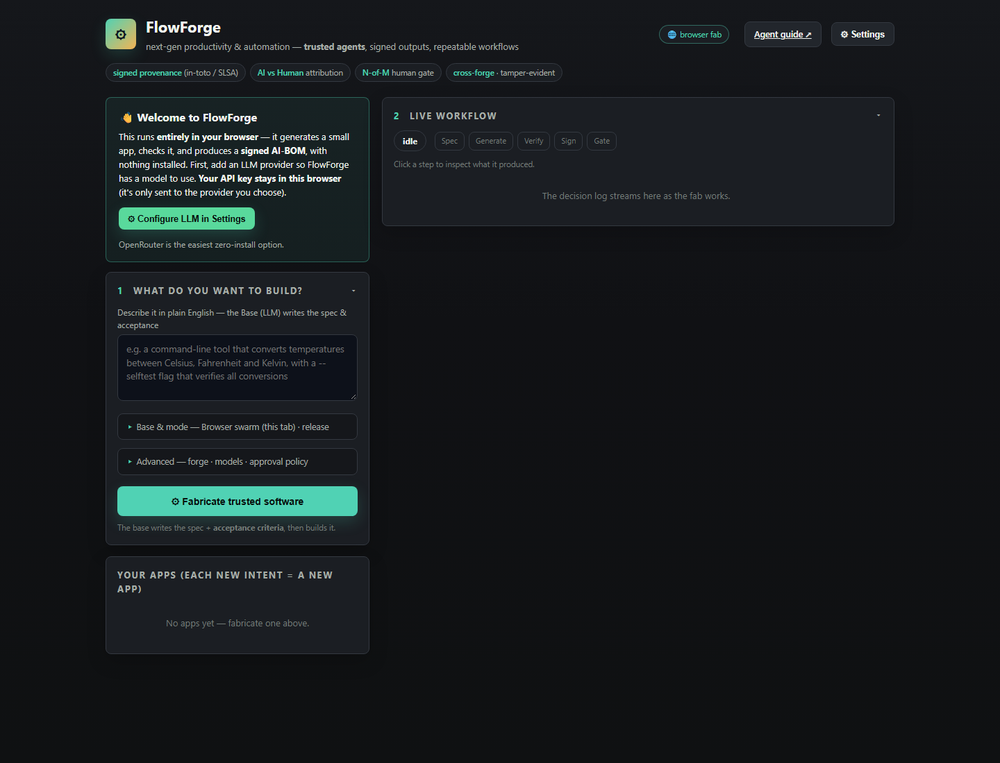
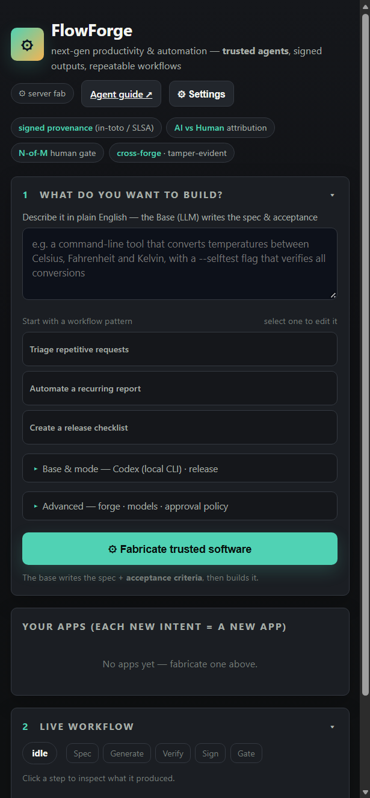

# FlowForge

**Turn repetitive work into executable, reviewable automation with AI agents and portable proof.**

FlowForge is a local-first automation fab. Describe a tool or workflow in plain language, let a swappable agent base generate it, run machine-checkable acceptance criteria, inspect the result, and release it with signed provenance.

> Current status: source snapshot prepared for local development and static browser-mode deployment. No live demo URL has been claimed because no deployment has been verified from this workspace.

## Why FlowForge

AI can reduce repetitive work, but generated output is difficult to review after the fact. FlowForge makes the workflow visible and the release evidence portable:

- Natural-language intent becomes a structured spec and acceptance contract.
- Agent bases generate the requested app or utility through a stable port.
- Acceptance checks run before approval and are recorded with their commands and results.
- Release mode creates an SBOM, signed attestation, and human sign-off state.
- Verification can be repeated from committed bytes, independently of the forge that hosted them.

FlowForge is not a generic chat interface. Its central unit is a reviewable workflow that moves from intent to generated artifact to verified outcome.

## Screenshots

These are real captures of the repository's browser UI:





Additional workflow captures are available under [`docs/img/`](docs/img/).

## Product Flow

```text
Intent -> Spec and acceptance -> Generate -> Verify -> Sign -> Gate -> Portable proof
```

1. Describe the repetitive task or small tool.
2. Select the agent base, forge, model, mode, and approval policy.
3. Review the generated spec and acceptance criteria.
4. Watch generation and verification progress in the live timeline.
5. Run or inspect the generated product.
6. Refine a draft or approve a release.
7. Reproduce the signed result from the attestation and source hashes.

## Core Features

### Intent to executable tool

The selected LLM authors a spec and acceptance contract from natural-language intent. A base adapter then generates files in the target workspace.

### Acceptance before release

Checks run through the policy-gated sandbox path. Failed checks remain visible and keep the release from being represented as accepted.

### Portable provenance

Release mode writes an in-toto Statement-style attestation with the `openfab/generation` predicate, generated-file digests, model information, prompt hash, acceptance evidence, and sign-off state.

### Human approval

Local `did:key` identities support solo, team, crowd, and no-gate policies. The system records who signed the artifact hash rather than relying only on a forge permission setting.

### Reproduction and verification

`openfab verify` and `openfab verify-file` re-check signatures, source digests, acceptance results, and sign-off requirements.

### Swappable bases and forges

Base and forge traits keep the core flow independent from a particular agent runtime or git host. Local git works offline; optional adapters cover GitHub, Forgejo, Gitea, and GitCode.

### Browser mode

The `web/` directory can run as a static page. Browser mode performs client-side generation, deterministic JavaScript checks in opaque-origin iframes, local signing, and bundle download or optional GitHub publishing. Host sandbox and local-git features require server mode.

## Architecture

```text
User intent
    |
    v
FlowForge web UI or CLI
    |
    v
src/server.rs or src/cli.rs
    |
    v
src/ops.rs -> src/spec_cycle.rs
    |                 |
    v                 +--> BasePort -> agent base
Policy-gated checks  +--> ForgePort -> git forge
    |
    v
Generated files + SBOM + signed attestation + run state
    |
    v
did:key sign-off and offline reproduction
```

The Rust binary embeds the static UI with `include_str!`, so local server mode ships as one binary and browser mode can be deployed independently from `web/`.

See [`ARCHITECTURE.md`](ARCHITECTURE.md) and the source diagrams in [`docs/diagrams/`](docs/diagrams/).

## AI and Agent Model

FlowForge has two distinct AI responsibilities:

1. A spec-author role derives structured intent, assumptions, and acceptance checks.
2. A base role generates the requested files using a selected native runtime or explicit LLM bridge.

Acceptance checks are deterministic commands or browser JavaScript checks, not a second model opinion. The human gate remains explicit. See [`AI_USAGE.md`](AI_USAGE.md).

### Codex integration

Codex is a first-class native base, not a README-only claim. The adapter invokes `codex exec`, captures the final JSON manifest, records the provider and model in the run, and sends the generated files through the same acceptance, provenance, and sign-off path as every other base. Source evidence is documented in [`docs/agent-architecture.md`](docs/agent-architecture.md).

## Technology Stack

- Rust 2021 with `clap` for the CLI.
- `tiny_http` for the local JSON API and embedded UI server.
- Static HTML, CSS, and JavaScript for the frontend.
- `serde`, `serde_json`, and `serde_yaml` for data contracts.
- `ed25519-dalek`, `bs58`, and `did:key`-style local identities for signing.
- SHA-256 digests, in-toto Statement-style provenance, and SPDX-lite SBOM output.
- Policy checks in Rust with a Rego reference policy in `policy/trust.rego`.
- Local git plus optional GitHub, Forgejo, Gitea, and GitCode adapters.

## Repository Structure

```text
.
|-- src/
|   |-- core/              # specs, identity, provenance, SBOM, trust, conformance
|   |-- ports/             # BasePort and ForgePort contracts
|   |-- adapters/          # agent, LLM, forge, and sandbox adapters
|   |-- cli.rs             # command-line interface
|   |-- server.rs          # local web UI and JSON API
|   |-- ops.rs             # shared operation layer
|   `-- spec_cycle.rs      # generation, verification, signing, and gate flow
|-- web/                   # static FlowForge browser UI
|-- specs/                 # sample specifications
|-- schemas/               # spec and provenance schemas
|-- policy/                # trust policy and Rego reference
|-- docs/                  # architecture, demo, audit, and submission material
|-- evals/                 # reproducible evaluation plan and workflow case
|-- demo/                  # local demo scripts
|-- integrations/          # optional agent-base adapters
|-- forges/                # optional Forgejo/Gitea local stack
|-- .env.example           # safe environment template
|-- ARCHITECTURE.md        # system boundaries and data flow
|-- AI_USAGE.md            # factual AI usage and limitations
`-- SECURITY.md            # security model and disclosure guidance
```

## Installation

Prerequisites:

- Rust stable with `rustfmt` and `clippy`.
- Git.
- Optional provider CLIs or services for the selected agent base.
- Optional `gh` and `curl` for live forge integrations.

```bash
rustup toolchain install stable
rustup component add rustfmt clippy
cargo build --release
```

## Local Development

```bash
./init.sh
cargo build --release
./target/release/openfab serve --repo demo/.work/web --port 8787 --policy policy/trust.json
```

Open `http://127.0.0.1:8787`.

The internal binary and protocol identifier remain `openfab` for compatibility. The UI and documentation use the FlowForge product identity.

## Environment Variables

Copy `.env.example` to `.env` and configure only the integrations you use. The local binary loads
that gitignored file at startup without overriding variables already present in the process.
Deployment providers should inject variables through their secure environment UI. Important groups include:

- `OPENFAB_LLM` and provider-specific Claude, Codex, OpenAI, Groq, Ollama, or DashScope settings.
- For OpenAI: set `OPENFAB_LLM=openai`, `OPENAI_API_KEY`, and `OPENFAB_OPENAI_MODEL`.
- For Groq: set `OPENFAB_LLM=groq`, `GROQ_API_KEY`, and `OPENFAB_GROQ_MODEL`.
- OpenAI and Groq are called through their OpenAI-compatible Chat Completions APIs. Their API keys
  stay server-side in local/server mode. The model must be available to the account and support
  JSON responses because FlowForge requests structured specs and file manifests.
- Codex generation defaults to read-only execution. Set `OPENFAB_CODEX_SANDBOX=workspace-write` only when needed; dangerous full access requires a separate opt-in.
- `OPENFAB_GITHUB_REMOTE` and an authenticated `gh` CLI for GitHub.
- `OPENFAB_FORGEJO_*`, `OPENFAB_GITEA_*`, or `OPENFAB_GITCODE_*` for REST forge adapters.
- `OPENFAB_AGENTSCOPE_URL`, `OPENFAB_HICLAW_URL`, `OPENFAB_AGENTCHAT_URL`, and `OPENFAB_OPENHANDS_URL` for optional agent bases.
- `OPENFAB_HOME` for the local runtime home.

Never commit `.env`, API keys, tokens, passwords, signing seeds, or maintainer identities. Runtime identities are created under the selected workspace's `.openfab/` directory.

## Production Build

```bash
cargo fmt --all -- --check
cargo clippy --all-targets --all-features -- -D warnings
cargo test
cargo build --release
```

The release binary embeds the web UI. Static browser deployment can instead publish the contents of `web/`.

## Deployment

### Static browser mode

Publish `web/` to GitHub Pages, Netlify, Cloudflare Pages, or another static host. Browser mode cannot provide host git, shell sandboxing, local CLI bases, or file-manager integration. Users configure an LLM provider in the browser; the key is stored in browser storage and sent only to the selected provider.

The Pages automation template is [`.github/pages-workflow.yml`](.github/pages-workflow.yml). Activate it as `.github/workflows/pages.yml` after authenticating with GitHub workflow scope.

The repository CI workflow template is [`.github/ci-workflow.yml`](.github/ci-workflow.yml). Move
it to `.github/workflows/ci.yml` after authenticating with GitHub workflow scope; it runs Rust
formatting, clippy, tests, release build, and browser JavaScript syntax checks. A lightweight
liveness probe is available at `GET /health` when the local/server binary is running.

### Local or server mode

Run the release binary on a host with a persistent workspace:

```bash
./openfab serve --repo /var/lib/flowforge/workspace --port 8787 --policy policy/trust.json
```

For a local PowerShell session using Groq, for example:

```powershell
$env:OPENFAB_LLM = "groq"
$env:GROQ_API_KEY = "<your-key>"
$env:OPENFAB_GROQ_MODEL = "<a-model-enabled-for-your-account>"
.\target\release\openfab.exe serve --repo demo/.work/web --port 8787 --policy policy/trust.json
```

OpenAI uses the same setup with `OPENFAB_LLM=openai`, `OPENAI_API_KEY`, and
`OPENFAB_OPENAI_MODEL`. Do not put the real values in the repository.

Use a reverse proxy and TLS before exposing the local server beyond localhost. The current server has no application login layer, so remote exposure requires an external authentication boundary.

No live deployment URL is included because deployment has not been performed or verified from this workspace.

## Security Model and Limitations

- Commands pass through a policy allowlist/denylist before execution.
- Acceptance and reproduction checks have hard timeouts.
- Browser checks execute in fresh opaque-origin `sandbox="allow-scripts"` iframes.
- Prompt hashes are stored in provenance instead of raw prompts.
- Browser and server credentials remain runtime configuration, never repository content.
- Server mode currently records `gated-host-subprocess` for its fallback sandbox. This is a policy gate and timeout boundary, not container isolation.
- Do not expose server mode on an untrusted network without an authentication and TLS boundary.

See [`SECURITY.md`](SECURITY.md).

## Testing and Verification

The intended validation commands are:

```bash
cargo fmt --all -- --check
cargo clippy --all-targets --all-features -- -D warnings
cargo test
cargo build --release
```

Verified in this workspace with stable Rust 1.98.1 using the GNU Windows toolchain: formatting, clippy with `-D warnings`, 57 unit tests, and the optimized release build all pass. Browser and integration syntax checks are documented in [`docs/REPOSITORY_AUDIT.md`](docs/REPOSITORY_AUDIT.md).

The credential-free trust path is also reproducible with [`evals/run_offline_fixture.ps1`](evals/run_offline_fixture.ps1): it runs three sandboxed acceptance checks, writes signed provenance and an SBOM, and re-verifies the source and contract with `verify-file`. This fixture does not claim provider-backed AI generation; that path requires a configured OpenAI, Groq, or other supported provider.

## Demo Materials

- [`docs/demo-script.md`](docs/demo-script.md): timed narration, actions, expected states, and fallback path.
- [`docs/demo/flowforge-demo.srt`](docs/demo/flowforge-demo.srt): draft subtitle timing for a 3-minute recording.
- [`docs/poster/flowforge-poster.html`](docs/poster/flowforge-poster.html): printable hackathon poster layout.
- [`docs/HACKATHON_ALIGNMENT.md`](docs/HACKATHON_ALIGNMENT.md): factual track mapping and reviewer notes.
- [`docs/COMPETITIVE_BENCHMARK.md`](docs/COMPETITIVE_BENCHMARK.md): evidence-based comparison with the ScreenOps reference repository.
- [`evals/README.md`](evals/README.md): reproducible evaluation plan and canonical workflow case.

No demo video has been recorded and no public video link is claimed.

## Roadmap

- Replace the fallback host subprocess with a production container runtime such as Podman or gVisor.
- Add an authenticated server deployment profile.
- Add Rust integration tests around HTTP routes and the full local forge cycle.
- Add automated screenshot capture in CI.
- Expand live forge deployment examples for user-owned accounts.

## Contributing

See [`CONTRIBUTING.md`](CONTRIBUTING.md). Preserve the BasePort and ForgePort boundaries, keep secrets out of the repository, and run formatting, clippy, and tests before submitting changes.

## License and Attribution

Apache-2.0. See [`LICENSE`](LICENSE). The OpenFab protocol identifiers and trust-engine architecture are preserved for compatibility and provenance. Third-party notices remain in the repository where applicable.
